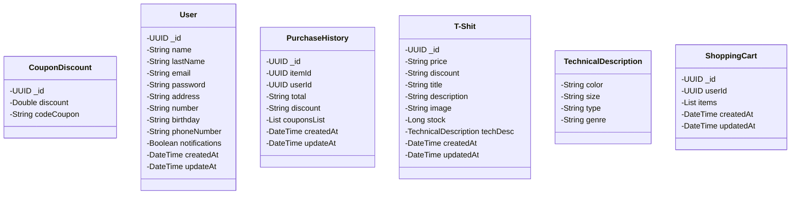

## :construction: - Project Shirt-Store:

- Projeto de uma loja de camisetas para venda;

##

  
  
  

##

## 📋 - Diagrama de Classes:

```mermaid
classDiagram
  class CouponDiscount {
    -UUID _id
    -Double discount
    -String codeCoupon
  }

  class User {
    -UUID _id
    -String name
    -String lastName
    -String email
    -String password
    -String address
    -String number
    -String birthday
    -String phoneNumber
    -Boolean notifications
    -DateTime createdAt
    -DateTime updateAt
  }

  class PurchaseHistory {
    -UUID _id
    -UUID itemId
    -UUID userId
    -String total
    -String discount
    -List couponsList
    -DateTime createdAt
    -DateTime updateAt
  }

  class T-Shit {
    -UUID _id
    -String price
    -String discount
    -String title
    -String description
    -String image
    -Long stock
    -TechnicalDescription techDesc
    -DateTime createdAt
    -DateTime updatedAt
  }

  class TechnicalDescription {
    -String color
    -String size
    -String type
    -String genre
  }

  class ShoppingCart {
    -UUID _id
    -UUID userId
    -List<Item> items
    -DateTime createdAt
    -DateTime updatedAt
  }
```

